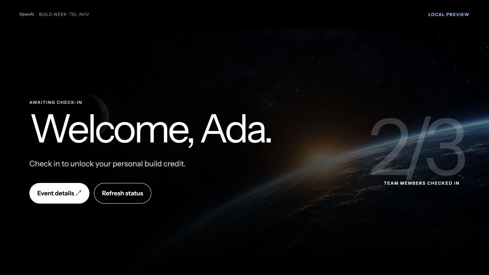
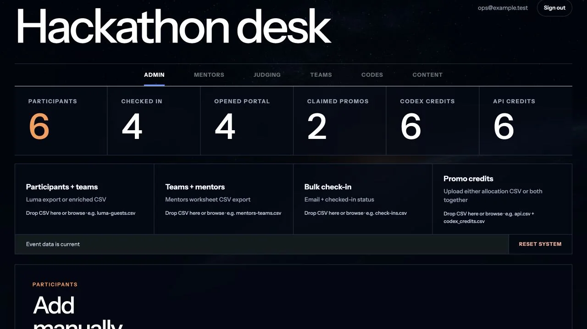
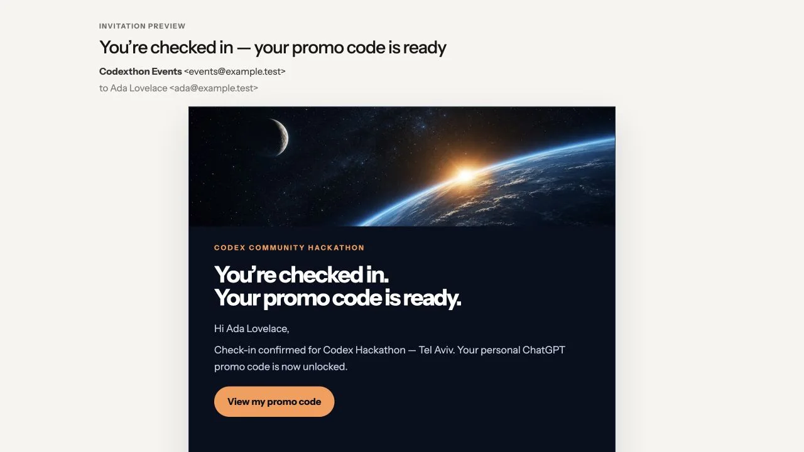

# Codexthon

A deploy-your-own event operations portal for participant check-in, team coordination, promo distribution, judging assignments, Google Drive photo synchronization, privacy-conscious analytics, email invitations, and MCP access.

The easiest deployment path uses [Base44 Backend](https://base44.com/backend) for the database, authentication, server functions, integrations, and hosting. Participant data and backend secrets stay in your Base44 workspace, while Gmail and Drive use Google accounts you authorize. This repository contains only the application code, schemas, and synthetic fixtures.

## See it in action

These screenshots use synthetic `.test` addresses and demo values.

### Participant portal

Participants see their check-in state, team progress, event details, and credits in one personal portal.



### Admin dashboard

Operators can track arrivals and portal activity, import event data, manage credits, and deliver personal links.



### Invitation email

Checked-in participants receive a branded personal link. Gmail is the default Base44 connector; a ChatGPT Sites migration can use Resend.



## Choose a hosting path

### Recommended: Base44 Backend

This repository is implemented against Base44, so this path requires configuration but no backend rewrite. Deploying creates a separate app under your Base44 account rather than a server you operate yourself.

One Base44 deployment includes:

- A React and TypeScript web application
- Base44 entities for event data
- Base44 backend functions
- Google authentication
- Optional Gmail and Google Drive connectors
- Base44 Analytics events and operational reporting
- Admin and participant MCP servers

### Other hosting platforms

Base44 is the easiest option because this repository already uses its database, authentication, functions, connectors, and hosting. You can also ask Codex to migrate the project to [ChatGPT Sites](https://learn.chatgpt.com/docs/sites), Vercel, Cloudflare, or another platform.

A migration needs replacements for the Base44 backend services. For example, use [Resend](https://resend.com/) for email and keep the Admin and User MCP servers available through authenticated HTTPS endpoints.

## Features

### Participant portal

- Personal event page with check-in status
- Team name, table assignment and location note, plus teammate check-in and contact details
- Mentor details and contact information
- Event agenda, logistics, Wi-Fi details, resources, and Q&A
- Build categories and event guidance
- Promo credits revealed after check-in
- Optional partner coupon and registration link
- Privacy-conscious usage analytics with coarse, non-identifying events
- Google Drive-backed photo gallery with saved personal picks and participant-folder synchronization

### Authentication, access, and invitation delivery

- Google sign-in through Base44
- Personal signed access links for participants
- Link rotation and revocation
- Session-safe links carried in the URL fragment
- Admin and participant roles
- Branded Gmail invitations sent individually or in bulk to participants and mentors
- Eligibility checks that restrict participant-link delivery to active, checked-in recipients
- Send, retry, and explicit resend modes with request IDs and idempotent attempt keys
- Pending, accepted, failed, unknown, and skipped delivery states
- Append-only access-email audit records with actor, time, action, provider result, and safe error code

Email/password login is not exposed by the current interface. The default authentication configuration enables Google login; participants can also use their unique personal link.

### Participant administration

- Import participants and teams from a Luma CSV export or enriched CSV
- Admit only approved guests from raw Luma exports and isolate unmatched participants until assigned
- Reconcile repeat imports without replacing personal access identities
- Disable removed participants while preserving manual exceptions
- Add participants manually
- Search and filter the door list
- Check participants in or out individually or in bulk
- Import check-in status changes from CSV
- Edit participant email addresses safely
- Edit participant phone, LinkedIn URL, and custom profile fields
- Inspect participant, team, mentor, promo, photo, and access-email status
- Copy, send, rotate, and audit personal access links
- Export the participant roster as CSV without access credentials

Luma integration is file-based. The application does not currently perform a live Luma API sync.

### Promo codes

- Import Codex and API allocation CSV files together or separately
- Pair staged allocations when the second file arrives
- Assign one complete promo pair at check-in
- Preserve assignments across repeat scans and roster imports
- Reassign promos through the admin MCP
- Block or unblock unassigned promos
- Track available, assigned, incomplete, and blocked inventory
- Search and filter the assignment ledger and copy complete credit pairs
- Export the assignment ledger as CSV
- Hide promo values from participants until check-in

### Teams and mentors

- Team directory with participant membership
- Team detail pages
- Mentor directory with add, edit, delete, search, and CSV export
- Mentor-to-team assignment
- Table assignment and location note per team
- Teams and mentors CSV import
- Individual and bulk mentor invitations through Gmail
- Mentor portal with assigned teams and participant details

### Judging assignments

- Judge directory with contact details
- Judge groups composed from judges and mentors
- Team-to-judge-group assignment
- Enforcement that each team belongs to at most one judge group
- Judge and group CSV exports

The app manages the judging roster and assignments. Scoring, ranking, deliberation, and results are not implemented yet.

### Event settings

Admins can manage participant-facing content without changing source code:

- Event name and public event URL
- Venue details
- Primary and secondary Wi-Fi networks
- Agenda
- Promo instructions
- Questions and answers
- Optional partner coupon and registration URL

### Analytics

- Show operational counts for participants, check-ins, portal opens, promo claims, credit inventory, and access-email delivery
- Track first and most recent portal visits plus each participant's first promo claim
- Include portal-opened and promo-claimed timestamps in participant CSV exports
- Expose aggregate event status through the authenticated Admin MCP
- Send participant page views and completed or failed actions to Base44 Analytics
- Cover portal access, agent setup, promo and Wi-Fi interactions, photo selections, and Drive-folder exports
- Distinguish authenticated and signed-link access plus gallery view and page number
- Record only coarse targets, selected-photo counts, and safe failure categories

Analytics events exclude participant identifiers, URLs, personal keys, promo values, photo IDs, and raw error messages.

### Google Drive photo synchronization

- Use a configured Google Drive folder as the gallery source of truth
- Discover images in nested folders with bounded traversal and paginate large collections
- Preserve image orientation and link each gallery item to its original Drive file
- Save each participant's personal picks without modifying or copying source files
- Validate newly selected images against the configured event folder tree
- Create or reuse a participant-specific folder under a shared photo-picks parent folder
- Reconcile that folder on demand by copying new picks and trashing deselected copies
- Preserve the participant folder link across sessions and recreate the folder if it was deleted
- Share participant folders as read-only to anyone with the link

The Google Drive connector requests Drive access and creates participant folders in the connected account. Use a dedicated event account and folder. Treat participant folder links as sensitive because they are accessible to anyone who has the link.

### Admin MCP

The authenticated Admin MCP exposes tools for:

- Operational counts and delivery status
- Participant, team, mentor, judge, promo, and content lookup
- Redacted participant portal previews
- Participant, mentor, judge, and judge-group management
- Check-in and promo assignment
- Mentor, table, and judging assignments
- Access-link creation, rotation, and email delivery
- Participant, mentor, team, judge, and judge-group CSV export
- Participant, mentor/team, and promo imports
- Event content updates
- Full system reset as an explicit destructive action

Admin MCP requests require a separate bearer token. Read tools redact promo values and access keys by default.

### User MCP

Each participant can connect an agent to the read-only User MCP using their personal event key. It can answer questions about:

- Their check-in status
- Their team and teammates
- Their mentor
- Their available promo credits
- Event logistics and Wi-Fi
- Agenda
- Questions and answers
- Event resources

The participant portal generates a copyable Codex install command, verification prompt, and manual client configuration while masking the personal key on screen. A participant key cannot read another participant's data.

## Deploy with Base44

### What you need to configure

| Configuration | Required | Purpose |
| --- | --- | --- |
| Base44 project link | Yes | Connects this checkout to the Base44 app you own |
| `ADMIN_MCP_TOKEN` | Yes | Protects the Admin MCP endpoint |
| `ACCESS_LINK_SECRET` | Yes | Signs participant links and protects the User MCP endpoint |
| Admin user role | Yes | Grants access to `/admin` |
| `APP_URL` | For email | Sets the HTTPS origin used in participant and mentor invitations |
| Gmail connector | For email | Sends participant and mentor invitations |
| Google login | Recommended | Provides the admin and participant sign-in flow enabled by this repository |
| `EVENT_PHOTO_FOLDER_ID` | For photos | Selects the Google Drive folder used by the gallery |
| Google Drive connector | For photos | Reads event photos and creates participant pick folders |

Generate unique secrets for each deployment. Do not reuse the Admin MCP token as the access-link signing secret.

### 1. Requirements

- Node.js 22.18 or newer
- npm
- A [Base44 Backend](https://base44.com/backend) account
- A Google account if you want Google login, Gmail invitations, or Drive photos

### 2. Clone and install

```bash
git clone <your-fork-url>
cd codexthon
npm ci
```

### 3. Create your Base44 app

Authenticate the local Base44 CLI, then create and link a new app:

```bash
npx base44 login
npx base44 link --create --name my-event-portal
```

The generated `base44/.app.jsonc` links this checkout to your app. It is ignored by Git and must not be committed.

To use an existing Base44 app instead:

```bash
npx base44 link
```

Select the existing backend project when prompted.

### 4. Configure backend secrets

Generate separate random values for the Admin MCP token and access-link signing secret:

```bash
npx base44 secrets set \
  ADMIN_MCP_TOKEN=<random-admin-token> \
  ACCESS_LINK_SECRET=<separate-random-signing-secret>
```

Add the public application URL if you will send invitations:

```bash
npx base44 secrets set APP_URL=https://your-event.example
```

`APP_URL` must use HTTPS. Set it to the Base44 URL printed after deployment or to your custom domain. Invitation delivery fails if it is missing or invalid.

If you want the Drive-backed gallery and participant-folder synchronization, also set:

```bash
npx base44 secrets set EVENT_PHOTO_FOLDER_ID=<google-drive-folder-id>
```

Do not reuse these values or store them in `.env`, source files, issue reports, or screenshots.

### 5. Connect optional Google services

The repository includes Gmail and Google Drive connector definitions. If you use either feature, push the connectors from an interactive terminal and authorize the Google account that will send invitations or own the event photo folder:

```bash
npx base44 connectors push
```

Gmail is used only for invitation delivery. Google Drive is the gallery source of truth and stores the synchronized participant photo folders.

### 6. Customize the event shell

Most event content is editable after deployment, but the repository still ships with Build Week visual copy and email styling. Review these files before publishing your instance:

- `app/LoginScreen.tsx` for the login-page title and introduction
- `app/ParticipantDashboard.tsx` for participant-page labels and guidance
- `src/build-categories.ts` for the default build categories
- `base44/functions/access-admin/branded-email.ts` for participant invitations
- `base44/functions/mentor-invite/branded-email.ts` for mentor invitations
- `public/` and `ASSETS.md` for visual assets and their provenance

Keep asset licensing and trademark notices accurate when replacing the included artwork.

### 7. Deploy

Run every validation gate, then deploy the entities, functions, connectors, authentication configuration, and site:

```bash
npm test
npm run test:mcp
npm run typecheck
npm run build
npm run deploy -- --yes
```

The deploy command prints the Base44 dashboard and application URLs. If you did not know the final URL earlier, store it now:

```bash
npx base44 secrets set APP_URL=https://your-deployed-app.example
```

Grant your operator account the `admin` role in the Base44 app before opening `/admin`.

### 8. Load event data

Open `/admin` and configure the event in this order:

1. Upload the Luma participant CSV or an enriched participant CSV.
2. Upload the teams and mentors CSV if you use a separate assignment worksheet.
3. Upload Codex and API promo allocation CSV files.
4. Add judges and create judge groups.
5. Assign mentors, tables, and judging groups to teams.
6. Set event content, agenda, Wi-Fi, Q&A, and partner details.
7. Check in a test participant and verify their personal page before sending invitations.

Use synthetic data while testing. Real attendee exports and promo values must stay outside the repository.

## Connect the Admin MCP on Base44

The local proxy keeps the Admin MCP token in the macOS Keychain instead of an MCP client configuration file.

Store the same token used for `ADMIN_MCP_TOKEN`:

```bash
security add-generic-password \
  -a "$USER" \
  -s codexthon-admin-mcp \
  -U \
  -w
```

The final `-w` prompts for the token without placing it in shell history.

Run the proxy with your deployed function URL:

```bash
ADMIN_MCP_ENDPOINT=https://your-event.example/functions/admin-mcp \
  node --experimental-strip-types mcp/admin-mcp-proxy.ts
```

Configure your MCP client to start that command over stdio. Keep `ADMIN_MCP_ENDPOINT` in the client environment, but keep the bearer token in Keychain.

## Architecture

| Component | Responsibility |
| --- | --- |
| `app/` | React participant, mentor, and admin interfaces |
| `base44/entities/` | Event data schemas and row-level permissions |
| `base44/functions/` | Portals, email delivery, photos, imports, and MCP endpoints |
| `mcp/admin-mcp-proxy.ts` | Local authenticated bridge to the remote Admin MCP |
| `src/` | Shared domain logic, CSV parsing, reconciliation, and tests |
| `public/` | Original generated visual assets |
| `adr/` | Accepted architecture decisions and their rationale |

## Security and data handling

- Participant and mentor entities are admin-only.
- Participant functions return only data permitted for the current identity or signed link.
- Promo codes and access keys are credentials.
- Admin MCP and personal access links use separate secrets.
- Credential-returning and destructive MCP actions are explicit.
- Repository fixtures use synthetic people and values.
- Do not commit attendee exports, live identifiers, Wi-Fi credentials, browser traces, connector tokens, access links, or promo values.

See [SECURITY.md](SECURITY.md) for private vulnerability reporting.

## Roadmap ideas

- Group event photos by detected faces, with an explicit consent and privacy model
- Add scoring, ranking, deliberation, and results to the existing judging assignment pages
- Add a live Luma integration instead of CSV-only import
- Add a complete email/password login interface

## License

Source code is available under the [MIT License](LICENSE). See [NOTICE](NOTICE) and [ASSETS.md](ASSETS.md) for trademark and visual-asset notes.
